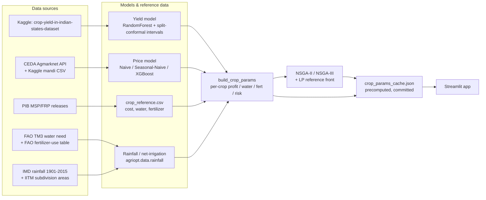

# AgriOpt

[](https://github.com/Dhwanitisshah/agriopt/actions/workflows/tests.yml)

**Live demo:** `[TODO: Streamlit Community Cloud URL once deployed]`

Maharashtra's farmers choose what to plant largely on habit and last year's prices, with no
systematic way to weigh profit against water use, fertilizer load, food-crop security, or
year-to-year risk. AgriOpt is a data-driven crop allocation tool for Maharashtra: it combines a
trained crop-yield model, a price forecasting model, and government reference data (cost of
cultivation, MSP/FRP, water need, fertilizer dose, rainfall) into a per-hectare economic profile
for 8 major crops (rice, wheat, jowar, soybean, cotton, sugarcane, tur, maize), then runs a
multi-objective optimizer (NSGA-II/NSGA-III, cross-checked against an exact LP reference) to
recommend how a farmer should split their land across those crops under their own land, water,
and food-security constraints. A Streamlit app exposes the recommendation, its trade-offs against
simpler baselines, a historical backtest, and the full evidence trail (model metrics, significance
tests, data sources) behind every number it shows.

## Architecture



The app never loads the ~528 MB trained yield model or the price model at request time. A
dedicated offline script (`scripts/40_build_cache.py`) calls the modeling layer once, precomputes
every scenario the app's UI can produce, and writes the result to a single committed JSON file
(`data/processed/crop_params_cache.json`) that the app reads on every request.

## Key results

Headline numbers below are pulled directly from `reports/results/RESULTS_INDEX.md`, the
consolidated results index spanning all phases of this project; see that file (and the
experiment-specific `.md` files it cites) for full detail and every caveat.

| Result | Headline number | Caveat |
|---|---|---|
| Profit-per-water vs current mix (decision backtest, 2016-2019) | OURS: mean profit per 1,000 m³ water = ₹9,051-9,271 vs current-mix (B1) ₹5,636 | Realized-outcome metrics computed over **n=4 years (2016-2019)**, not the intended 5 -- Maharashtra's yield data has zero rows for 2020. Directional, not statistically conclusive. |
| Water-matched capture ratio (`capture_ratio_w`) | OURS ≈ 0.966-0.966 of the water-matched oracle's profit; MODEL_B (risk-aware) ≈ 0.862-0.880 | Same n=4 caveat as above. |
| Same-profit-less-water (B3 vs B1) | B3 matches B1's profit (+0.0%) using **57.5% less water** (tight/market scenario) | B2 (profit-max) beats B1 by +108.4% profit but concentrates into ~2 crops (not diversified). |
| Region comparison (Konkan vs Marathwada, net-irrigation basis) | OURS profit: Marathwada ₹253,960 (water 20,845 m³) vs Konkan ₹232,078 (water 13,365 m³) | Marathwada's drier normal-year rainfall raises rice's net irrigation need to 232mm vs Konkan's 200mm; region changes water cost, not the crop's agronomic need. |
| Yield model significance (Wilcoxon, Maharashtra test, n=152) | RandomForest significantly beats XGBoost (p=0.009) and Ridge (p<0.001) | RF vs Baseline-Mean is **not** significant (p=0.469) -- "RF is best" is not uniformly supported. |
| Price model significance (Diebold-Mariano, pooled) | Naive significantly beats XGBoost at h=6 (p=0.031) and h=12 (p=0.020) | Per-crop DM tests (n~36-45) are noisier/less powered than pooled (n~252-315); pooled is the headline. |
| Yield conformal intervals (90% nominal) | Overall Maharashtra empirical coverage = 0.941 (mean width 2.53 t/ha) | Per-crop coverage varies (cotton/tur measured at 0.75) -- always check per-crop before trusting one crop's interval. |

## Data sources

- **Yield**: Kaggle [crop-yield-in-indian-states-dataset](https://www.kaggle.com/datasets) (APY-style: area/production/yield by state/crop/season/year)
- **Prices**: [CEDA Agmarknet API](https://api.ceda.ashoka.edu.in/documentation/) (primary, mandi modal prices); Kaggle mandi CSV (secondary, few crops)
- **Cost of cultivation & MSP**: PIB / Dept. of Agriculture & Farmers Welfare Kharif/Rabi Marketing Season price releases (see `data/reference/msp_history.csv`'s `source_url` column for the exact PDF cited per crop-year, e.g. `desagri.gov.in/wp-content/uploads/...MSP-kharif-2016-17.pdf`)
- **Sugarcane price**: CCEA Fair and Remunerative Price (FRP), not MSP -- see `admin_price_rs_per_qtl` in `data/reference/crop_reference.csv`
- **Crop water need**: FAO Irrigation and Drainage Paper (TM3) crop water requirement tables
- **Fertilizer dose**: FAO (2005) *Fertilizer use by crop in India*, Table 13 (soybean: ICAR-IISS recommended dose)
- **Rainfall**: Kaggle `rajanand/rainfall-in-india` (IMD sub-divisional monthly rainfall, 1901-2015)
- **Subdivision areas** (for the area-weighted Maharashtra state-wide average): IITM (Indian Institute of Tropical Meteorology, Pune) subdivisional rainfall metadata, [tropmet.res.in/data/data-archival/rain/iitm-subdivrf.txt](https://www.tropmet.res.in/data/data-archival/rain/iitm-subdivrf.txt)

## Reproduce

```powershell
python -m venv .venv
.\.venv\Scripts\Activate.ps1
pip install -r requirements.txt
pip install -e .
```

Fetch data (requires Kaggle auth + a CEDA API key in `.env`, see `.env.example`):

```powershell
.\scripts\00_download.ps1
python scripts\01_audit_yield.py
python scripts\03_fetch_ceda_prices.py
python scripts\02_audit_prices.py
```

Train models and run the core experiments, in order (each script's own docstring documents its
inputs/outputs; skip ahead only if you already have that script's output committed/cached):

```powershell
python scripts\10_train_yield.py
python scripts\20_train_price.py
python scripts\30_run_optimizer.py
python scripts\31_run_risk.py
python scripts\50_ablation.py
python scripts\60_backtest.py
python scripts\61_backtest_v2.py
python scripts\70_water_basis_net.py
python scripts\71_water_region.py
python scripts\90_price_significance.py
python scripts\91_yield_significance.py
python scripts\92_conformal.py
python scripts\93_loso.py
python scripts\94_seed_robustness.py
```

Build the app's cache (the only thing the app itself ever reads) and run it:

```powershell
python scripts\40_build_cache.py
streamlit run app\streamlit_app.py
```

Headless smoke test (no browser): `python scripts\smoke_e2e.py`

Run tests:

```powershell
pytest -q                       # full suite (needs the full gitignored dataset + trained models)
pytest -m "not needs_data" -q   # CI's subset -- only the committed cache + pure-function tests
```

## Deploying (Streamlit Community Cloud)

The app only needs the slim `requirements-app.txt` (pinned versions; no xgboost/shap/scikit-learn
-- those are training-only and never imported by the app's own live path) plus the committed
`data/processed/crop_params_cache.json`. `.streamlit/config.toml` sets `headless = true` and a
theme. See `requirements.txt` for the full dev/training dependency set.

## Limitations & future work

- **n=4 backtest years** (2016-2019): Maharashtra's yield dataset has zero rows for 2020, so every
  realized-outcome backtest metric (profit, win counts, Wilcoxon) is computed on 4 years, not the
  intended 5 -- low statistical power, read as directional only.
- **State-level, not district-level**: every model and the optimizer operate on Maharashtra-wide
  (or, since Phase 8.1, IMD-subdivision-wide) figures; a real deployment would need district- or
  even farm-level cost/yield/water data to be actionable for an individual farmer.
- **MSP-derived, not published, cost-of-cultivation** for most crop-years: `cost_a2fl_rs_per_qtl`
  in `data/reference/msp_history.csv` is largely index-derived rather than a directly published
  CACP figure -- see that file's `provenance` column.
- **Rice percolation/land-preparation water is a documented, uncited gap**: `net_irrigation_mm()`
  adds a citable FAO figure for puddled-rice saturation water (`RICE_EXTRA_MM`), but explicitly
  does NOT add percolation/seepage losses, which are highly soil-type dependent and have no single
  citable figure without inventing a soil assumption this repo has no data to support (see
  `docs/water.md`, Phase 8.1 section 3).
- **Sugarcane's low measured price risk is an FRP artifact**, not genuinely low agronomic risk
  (a fixed administered price has zero month-to-month variance by construction) -- the risk-aware
  model's sugarcane allocation is sensitive to this assumption (see `reports/results/risk_strategies.md`).
- Future work: district-level yield/cost data, state-specific (not all-India) cost of cultivation,
  a citable percolation/seepage figure for puddled rice, and extending the backtest window past
  2020 once more recent Maharashtra yield data becomes available.

## Screenshots

`[TODO: could not capture live screenshots in this environment -- see the agent's final report
for why. Capture 3 screenshots (Recommendation tab, Trade-offs tab, Regional view tab) from a
locally running `streamlit run app\streamlit_app.py` and save them to docs/img/ before replacing
this placeholder.]`

## Tests

```powershell
pytest -q
```

## Layout

- `src/agriopt/` — importable package (config, data loaders/cleaners, CEDA client, models, optimizer)
- `scripts/` — one-off download/fetch/audit/train/experiment scripts, plus `40_build_cache.py` (app cache) and `smoke_e2e.py`/`check_app_tabs.py` (headless demo smoke tests)
- `data/raw/` — downloaded, gitignored
- `data/raw/prices_ceda/` — cached raw CEDA API responses, gitignored
- `data/processed/` — cleaned parquet (gitignored) + `crop_params_cache.json` (app's only data input, **committed** via a `.gitignore` negation)
- `data/reference/` — hand-curated reference tables, committed
- `docs/formulation.md` — optimization problem formulation
- `docs/units.md` — Yield -> quintals-of-marketed-product unit conversions
- `docs/water.md` — total-need vs net-irrigation water accounting, region weighting (Phase 8/8.1)
- `docs/backtest.md` — decision backtest methodology and MSP/cost sourcing
- `reports/results/RESULTS_INDEX.md` — one row per experiment across every phase, with headline number + caveat
- `app/streamlit_app.py` — Streamlit demo entry point; `app/pipeline.py`/`app/data.py` hold non-UI logic; `app/components/` holds per-tab UI
- `requirements.txt` — full dev/training dependencies; `requirements-app.txt` — slim, pinned, app-only subset for deployment
