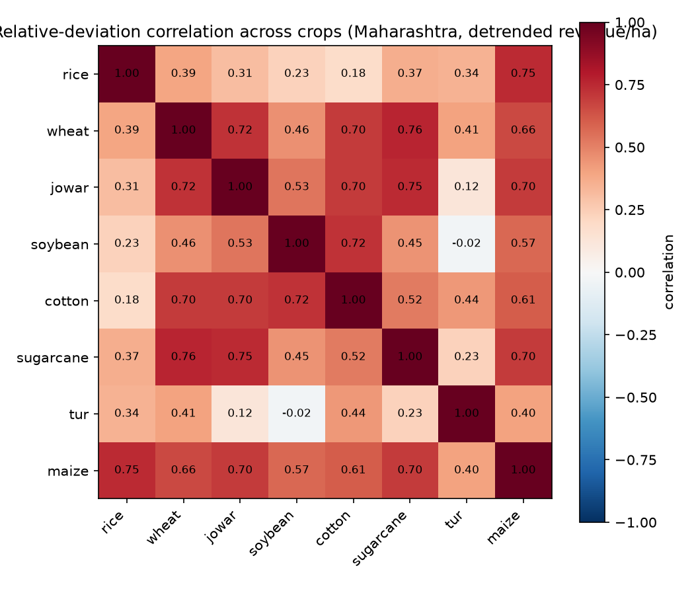

# Historical profit-risk model (Phase 5, Experiment 5 / Item 1)

Crop_Year convention is an ASSUMPTION (kharif: Oct-Dec of year t; rabi: Mar-May of year t+1) -- see `agriopt.optim.risk` module docstring; unverified against an independent source, flagged, not silently trusted.

Sigma (revenue covariance, Rs^2) minimum eigenvalue before PSD clipping: 5,869,552.56 (already PSD, no clipping applied).

## Per-crop revenue variability (Maharashtra, detrended)

| crop | n years | CV (raw revenue) | log-revenue trend (per year) |
|---|---|---|---|
| rice | 19 | 0.582 | +0.1129 |
| wheat | 19 | 0.347 | +0.0626 |
| jowar | 19 | 0.512 | +0.0927 |
| soybean | 19 | 0.429 | +0.0639 |
| cotton | 18 | 0.589 | +0.0925 |
| sugarcane | 21 | 0.097 | -0.0023 |
| tur | 19 | 0.579 | +0.0578 |
| maize | 19 | 0.458 | +0.0755 |

## Correlation matrix

| crop | rice | wheat | jowar | soybean | cotton | sugarcane | tur | maize |
|---|---|---|---|---|---|---|---|---|
| rice | 1.00 | 0.39 | 0.31 | 0.23 | 0.18 | 0.37 | 0.34 | 0.75 |
| wheat | 0.39 | 1.00 | 0.72 | 0.46 | 0.70 | 0.76 | 0.41 | 0.66 |
| jowar | 0.31 | 0.72 | 1.00 | 0.53 | 0.70 | 0.75 | 0.12 | 0.70 |
| soybean | 0.23 | 0.46 | 0.53 | 1.00 | 0.72 | 0.45 | -0.02 | 0.57 |
| cotton | 0.18 | 0.70 | 0.70 | 0.72 | 1.00 | 0.52 | 0.44 | 0.61 |
| sugarcane | 0.37 | 0.76 | 0.75 | 0.45 | 0.52 | 1.00 | 0.23 | 0.70 |
| tur | 0.34 | 0.41 | 0.12 | -0.02 | 0.44 | 0.23 | 1.00 | 0.40 |
| maize | 0.75 | 0.66 | 0.70 | 0.57 | 0.61 | 0.70 | 0.40 | 1.00 |

Mean pairwise correlation across all crop pairs is 0.49 -- broadly positive, consistent with a shared Maharashtra monsoon-quality driver behind most crops' year-to-year yield swings, even after each crop's own trend is removed.
Sugarcane's CV is far lower than the mandi-priced crops (variance from yield only -- no market price series, see module docstring), but its correlations with the other crops are NOT small (mean 0.54, up to 0.76 with wheat) -- since sugarcane's price is constant, any correlation it shows is pure yield co-movement, i.e. a real signal that Maharashtra's cropping years are broadly good or bad together, not an artifact of a shared price index.
